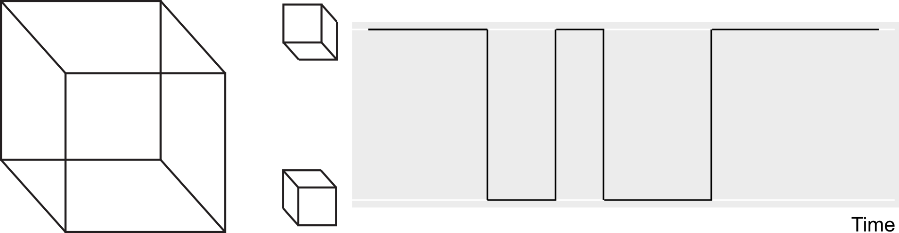
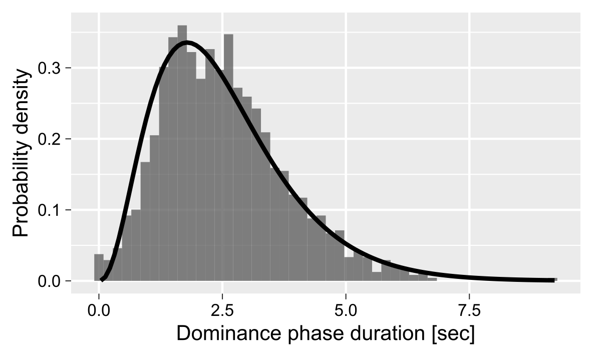

```{r setup, include = FALSE}
knitr::opts_chunk$set(
  collapse = TRUE,
  echo = FALSE,
  warning = FALSE,
  message = FALSE,
  comment = "#>"
)

library(dplyr)
library(ggplot2)
```

Certain stimuli, such as a Necker cube depicted below, are compatible with several, typically two, comparably likely perceptual interpretations. In case of the Necker cube, one can perceive as "upwards" or "downwards" and during continuous viewing the perception alternates between these alternatives (these alternations are schematically depicted on the right).

```{r out.width="80%", fig.align='center'}

```

A distribution of these so-called dominance phases typically has a right-skewed distribution that is frequently fitted using Gamma distribution.

```{r out.width="80%", fig.align='center'}

```

However, the individual dominance phases show a subtle but consistent serial dependence, see, for example, [van Ee (2009)](https://doi.org/10.1364/JOSAA.26.002612). This serial dependence is thought to reflect accumulation of slow adaptation [(Pastukhov et.al., 2013)](https://doi.org/10.3389/fncom.2013.00017) or prediction error [(Weilnhammer et al., 2017)[https://doi.org/10.1371/journal.pcbi.1005536] for the dominant percept. This slow accumulation process can be described via a homogeneous first order process. A brief summary on the formula and examples of accumulation over time for different initial values, signal strength, and time constants are presented below. For further details, please refer to [(Pastukhov & Braun, 2011)](https://doi.org/10.1167/11.10.12).

---

The cumulative history for a perceptual state computed via a homogeneous first order process:
$$\frac{dx_i}{dt} = \frac{1}{\tau} (-x_i + S_i(t))$$

where $\tau$ is the time constant, $x_i$ is cumulative history and $S_i(t)$ is current signal level for the state _i_, so that
$$S(t) = \begin{cases}
  1 & \text{if state $i$ is dominant}\\
  0 & \text{if state $i$ is suppessed}\\
  S_{mixed} & \text{if it is a mixed/transition phase and $0 ≥ S_{mixed} ≥1 $}
\end{cases}$$

The general solution for the equation is

$$
x_i(t) = A e^{-t/\tau} + \frac{1}{\tau} \int_{0}^{t} e^{-(t'-t)/\tau} S(t') dt'
$$

Assuming a constant signal $S$, we obtain
$$
x_i(t) = A e^{-t/\tau} + S (1 - e^{-t/\tau})
$$

In our case, we are interested in change of cumulative history during a particular dominance phase that start at time $t$ and end at time $t + \Delta t$. Solving for initial condition $x_i(t)$ and $S$:
$$x_i(t + \Delta t) = x_i(t) + (S - x_i(t)) \cdot (1 - e^{-\Delta t/\tau})\\
x_i(t + \Delta t) = S + (x_i(t) - S)  \cdot e^{-\Delta t/\tau}$$


The figure below shows accumulation over time for three different initial values ($x(0)$), signal strength ($S$), and and time constants ($tau$). Note that the package allows to either specify and fit both the time constant (argument `tau` in `fit_cumhist()` function) and the initial history value at the block (`history_init` argument).
```{r  fig.width=8, fig.height=4, out.width="80%", fig.align='center'}
t <- seq(0, 20, length.out=100)
df <- 
  data.frame(x0 = c(0, 0.7, 0.9), S = c(1, 0, 0.5), tau = c(1, 4, 2)) %>%
  group_by(x0, S, tau) %>%
  summarise(x0 = x0[1],
            S = S[1],
            tau = tau[1],
            t = t,
            x = S + (x0 - S) * exp(-t / tau),
            Parameters = sprintf("x(0) = %.1f, S = %.1f, tau = %d", x0[1], S[1], tau[1]),
            .groups="keep")

ggplot(df, aes(x=t, y=x, color=Parameters)) + 
  geom_line() + 
  xlab("dt [s]") +
  ylab("x(t + dt)") + 
  ylim(0, 1) + 
  theme(legend.position="top")
```

As for a bistable case there are two history states (one for each perceptual state), we compute a history "mixture" as 
$$H_{mix} = \text{history_mix} \cdot H_{dominant} + (1-\text{history_mix}) \cdot H_{suppressed}$$
where `history_mix` is a parameter that is either specified (the `fit_cumhist()` function uses a default of `0.2`) or fitted, whereas $H_{dominant}$ and $H_{suppressed}$ are history states for the currently dominant and suppressed states, respectively. _E.g._, if a left eye dominates during following phase, $H_{dominant} = H_{left}$ and $H_{suppressed} = H_{right}$ and vice versa.

